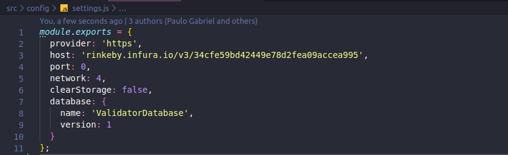

<p align="center">
  
</p>

<p>
<strong>Holon</strong> is a project to manage your identity in a decentralized way. The protocol was create to save user's data in Blockchain and give the power to the <i>user to control they own data</i>. 
 <strong>Validator</strong> is a example of platform to validate Holon users data. The user send the data to registered Validator into Blockchain and the validator can verify if that data is valide or not. Besides that the validator can choose if charge for this service.
The base of this extension are smart contracts, created to save and manage the user's data and relationship between users, validators and consumers.
</p>


### User Story

**First need to have a Holon Identity.**

 As a Validator
- I need balance in the wallet to pay a stake 
- I can choose the business strategy for the job.
- I can validate Persona's data on Holon Application
So that I can increase my reputation and get some kind of compensation

### Behavior
**Screen: Dashboard**
- I can see all my pending validations card
- Then I should see the details from request validation
- And I analyse the information
- Then I have 3 options: Valid, Not Valid and Not Evaluate

## Pre Requirements

- It is necessary install [Node](https://nodejs.org/en/) and [Npm](https://www.npmjs.com/).

## How to Install

To install in developer mode, follow the step-by-step:
1. Download the repository on your computer. 
2. Access the directory where you downloaded this project and run the command below.
```sh
  $ npm install
```

## How to set up ethereum node

This example uses a Infura Ethereum node. To set up your own node, follow the step-by-step:
- Open the **src** folder and access config folder
  - holon-validator-plugin -> src -> config
- Access **settings.js**. In this file it is possible change the "host" to a local node, Infura node or any node that you want use to run the web app. If you set up to use a local node, it is necessary change the port to your computer port.



## How to Run

Run the command below to start your project:
```sh
 $ npm start
```

## Tech

To build this application was used:

 Technologies | Version |
 ------ |------|
  React | 16.8.6 |
  Bootstrap | 3.3.7 |
  Babel | 7.4.5 |
